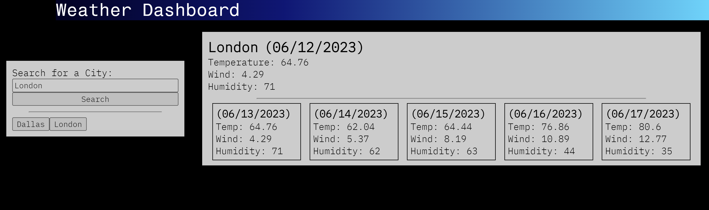

# Weather DashBoard

## Description
A simple weather dashboard/homepage to check the current weather and upcoming five-day forecast any where. It will also store previous searches so you can view them again easily.

## Acceptance Criteria

* When city is searched, displays current and future conditions for that city and that city is added to the search history
* Displays city name, the date, an icon representation of weather conditions, the temperature, the humidity, and the wind speed
* Clicking a previous search button presents with current and future conditions for that city again

## Mockup

## Live Website
https://nicholewilburn.github.io/Weather-Dashboard/

## Credits
UOFM
DayJs
Google Fonts
OpenWeather APIs

## License

N/A